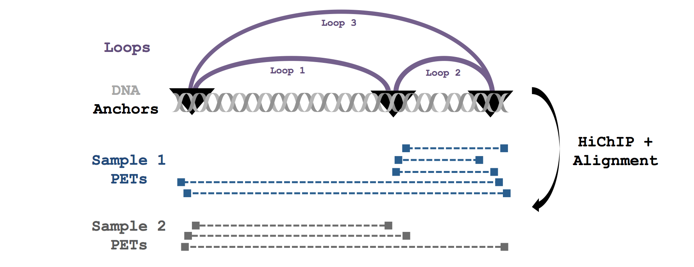
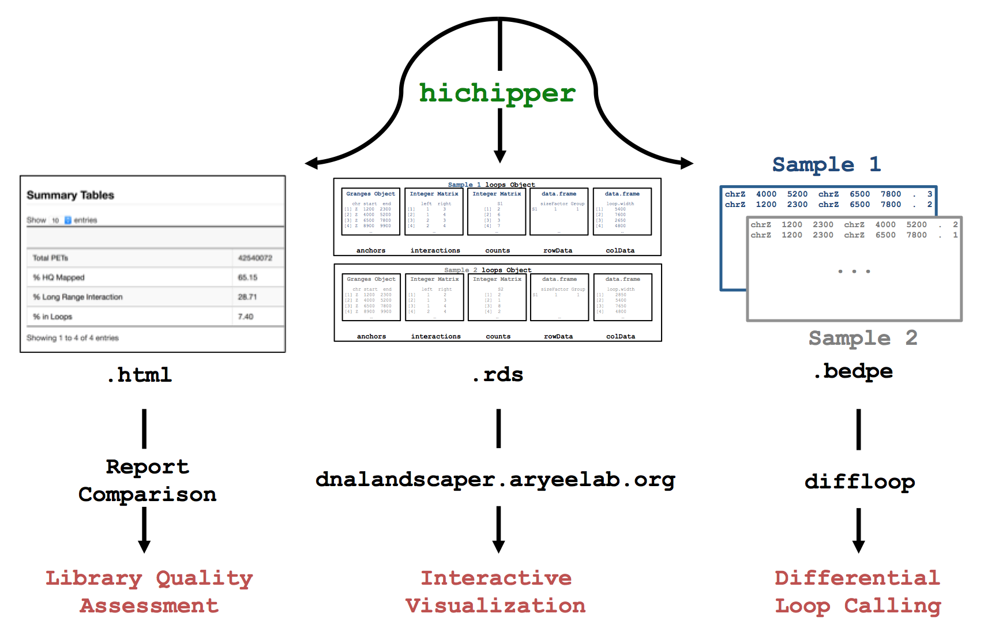

# hichipper
This package is maintained by [Caleb Lareau](caleblareau@g.harvard.edu) under the supervision of [Martin Aryee](http://aryee.mgh.harvard.edu/).

[](https://travis-ci.org/aryeelab/hichipper) [](https://badge.fury.io/py/hichipper) [](https://opensource.org/licenses/mit-license.php) 

## About<a name="about"></a>

The **hichipper** package implements our data processing and quality control pipeline for 
[HiChIP](http://www.nature.com/nmeth/journal/vaop/ncurrent/full/nmeth.3999.html) data.
This package takes aligned `.bam` files and a sample manifest file (`.yaml`) as input and produces
output that can be used to 1) determine quality of library prep, 2) visualize loops interactively,
and 3) estimate per-loop statistical confidence measures.

Check out the [big graphical overview](#int) to see how **hichipper** integrates with some other
tools to quickly assess the quality of your HiChIP library as well as find and visualize interesting
biology. 

## Table of Contents<a name="toc"></a>
- [About](#about)
- [Table of Contents](#toc)
- [User Overview](#ugo)
- [Dependencies](#dependencies)
- [Installation](#installation)
- [Simple Usage Example](#sue)
- [More typical example](#moe)
- [Configurations](#configuration)
- [Parameter Explainations](#pe)
- [Integration with other tools](#int)
- [Quality Control reports](#qcr)
- [Interactive visualization of loops](#viz)
- [Analyzing loops in the R](#loops)

## User Overview<a name="ugo"></a>
A simple graphical guide to processing HiChIP data is shown below. The role of **hichipper**
is to import `.bam` files from alignment software (e.g. [HiC-Pro](https://github.com/nservant/HiC-Pro))
as well as a sample `.yaml` file and produce user-friendly output. 
 


## Dependencies<a name="dependencies"></a>

The following dependencies need to be manually installed and available in the PATH when executing **hichipper**. 
- samtools
- bedtools

Additionally, to produce a QC report, R must be available in the environment as well as these packages:
- dplyr
- foreach
- ggplot2
- gridExtra
- reshape2
- scales

These can all be installed (if needed) running these lines of code in the R console--

```
install_pkgs <- function(pkg){
    new.pkg <- pkg[!(pkg %in% installed.packages()[, "Package"])]
    if (length(new.pkg)) install.packages(new.pkg, dependencies = TRUE)
}
install_pkgs(c("dplyr", "foreach", "ggplot2", "gridExtra", "reshape2", "scales"))
```

Finally, to produce a `.rds` file for immediate visualization of loops in [DNAlandscapeR](https://dnalandscaper.aryeelab.org),
the package `diffloop` must be installed either from Bioconductor or aryeelab. Run the following commands in the R console to get `diffloop` (if needed).  

```
install.packages("devtools") # if needed
devtools::install_github("aryeelab/diffloop")
```

## Installation<a name="installation"></a>

To install hichipper given the dependencies above, simply run:

```
pip install hichipper
```

## Simple usage example<a name="sue"></a>

The example below uses the test dataset bundled with the `hichipper` package source code. Download the package with:

```
git clone https://github.com/aryeelab/hichipper.git
```

1. Create a sample description file:
  
  Sample description files can be created with the `.yaml` format. 

  **Processing `.yaml` format**
   
   Example [yaml](https://en.wikipedia.org/wiki/YAML) format sample description file:
   
   ```
   samples:
      test_sample1: 
       - bam/t_1_hg19.bwt2merged.bam bam/t_2_hg19.bwt2merged.bam
      test_sample2:
       - bam/t_1_hg19.bwt2merged.bam bam/t_2_hg19.bwt2merged.bam
   ```
   
  In this example, the `test_sample1` sample is defined the `t_1_hg19.bwt2merged.bam` and `t_2_hg19.bwt2merged.bam` which
  where output files from [HiC-Pro](https://github.com/nservant/HiC-Pro). Any `.bam` files from Hi-C preprocessing
  software should be valid input. 
  
  
2. Run the pipeline:
```
hichipper --out output1 example.yaml
```

## More typical example<a name="moe"></a>
While the example above references files 

```
fastq/
|-- S75
|  |-- SRR3467175_1.fastq.gz
|  |-- SRR3467175_2.fastq.gz
|-- S76
|  |-- SRR3467176_1.fastq.gz
|  |-- SRR3467176_2.fastq.gz
|-- S77
|  |-- SRR3467177_1.fastq.gz
|  |-- SRR3467177_2.fastq.gz
|-- S78
|  |-- SRR3467178_1.fastq.gz
|  |-- SRR3467178_2.fastq.gz
hicpro_output/
|-- bowtie_results/
|  |-- bwt2/
|  |  |-- S75
|  |  |  |-- SRR3467175_1_hg19.bwt2merged.bam
|  |  |  |-- SRR3467175_2_hg19.bwt2merged.bam
|  |  |-- S76
|  |  |  |-- SRR3467176_1_hg19.bwt2merged.bam
|  |  |  |-- SRR3467176_2_hg19.bwt2merged.bam
|  |  |-- S77
|  |  |  |-- SRR3467177_1_hg19.bwt2merged.bam
|  |  |  |-- SRR3467177_2_hg19.bwt2merged.bam
|  |  |-- S78
|  |  |  |-- SRR3467178_1_hg19.bwt2merged.bam
|  |  |  |-- SRR3467178_2_hg19.bwt2merged.bam
config.yaml
config-hicpro-mboi-ext12.txt
```
The data in the `hicpro_output` directory could have been obtained by running: 
```
HiC-Pro -i fastq/ -o hicpro_output/ -c config-hicpro-mboi-ext12.txt -p
```
and subsequently executing Step 1 on a computing cluster node. 

Thus, the `config.yaml` file when executed from the current working directory would look like this:

```
samples:
  S75:
    - hicpro_output/bowtie_results/bwt2/S75/SRR3467175_1_hg19.bwt2merged.bam hicpro_output/bowtie_results/bwt2/S75/SRR3467175_2_hg19.bwt2merged.bam
  S76:
    - hicpro_output/bowtie_results/bwt2/S76/SRR3467176_1_hg19.bwt2merged.bam hicpro_output/bowtie_results/bwt2/S76/SRR3467176_2_hg19.bwt2merged.bam
  S77:
    - hicpro_output/bowtie_results/bwt2/S77/SRR3467177_1_hg19.bwt2merged.bam hicpro_output/bowtie_results/bwt2/S77/SRR3467177_2_hg19.bwt2merged.bam
  S78:
    - hicpro_output/bowtie_results/bwt2/S78/SRR3467178_1_hg19.bwt2merged.bam hicpro_output/bowtie_results/bwt2/S78/SRR3467178_2_hg19.bwt2merged.bam
```

And could be executed running this command: 

```
hichipper --out GM12878 config.yaml
```

## Configurations<a name="configuartions"></a>
Running
```
hichipper --help
```
shows the parameters that can be used in this software package as reproduced below.

  ```
  $ Usage: hichipper [OPTIONS] MANIFEST

  A preprocessing and QC pipeline for HiChIP data.

Options:
  --out TEXT          Output directory name [required]
  --peak-pad TEXT     Peak padding width (applied on both left and right); default = 1500
  --merge-gap TEXT    Max gap size for merging peaks; default = 1500
  --min-qual TEXT     Minimum quality for read; default = 30
  --read-length TEXT  Length of reads from experiment; default = 75
  --keep-temp-files   Keep temporary files?
  --skip-qc           Skip QC report generation? (Requires R + packages)
  --skip-diffloop     Skipp diffloop processing of loops? (Requires R + diffloop)
  --help              Show this message and exit.
  ```

## Parameter explanations<a name="pe"></a>
Describe each parameter... Pictures would be a plus

## Integration with Other Tools<a name="int"></a>


A higher resolution [slide of this image](media/Big.pptx) is in the [media](media) folder.

## Quality Control reports
Show two histrograms, make references, mention to send interesting reports for further collection (will be anon. unless made public). 

## Analyzing loops in the R<a name="loops"></a>
Talk about diffloop

## Interactive visualization of loops<a name="viz"></a>
Talk about DNAlandscapeR


